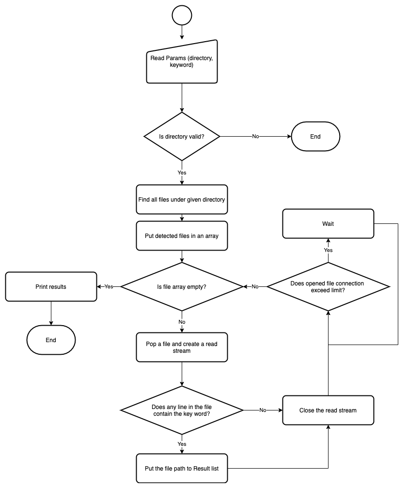

# Text Searcher

Text Searcher is a command line tool to search texts in files with a directory given.

# Installation

Install the dependencies

`npm install`

Run text searcher provided the target path and keyword

`npm start -- [path] [keyword]`

Example: search "TODO" under "./tests/sample" directory

`npm start -- ./tests/sample TODO`

Run unit tests

`npm run test`

# Program Flow

# Design Concerns

## Using read line instead of read file

Since the requirement states that only the file path is needed once the key word if found, reading the whole file into the memory is unnecessary. Some files may be extremely large, which may occupy a large amount of memory. Instead, reading the file line by line allows to exit from the read stream anytime if the key word if found, because reading lines reduce the burden of memory. Relatively smaller portion of memory is used.

## Using MAX_OPEN_FILE_COUNT to control file streams to open concurrently

There is a limitation on the maximum number of files can be open at the same time. Therefore, number of file streams to open has to be controlled.

`await Promise.all(tasks);` has to be executed after the number of opened file streams hit the maximum number. Otherwise, the program will be infinitely looping within `while` loop. After executing `await Promise.all(tasks);`, the async functions can be actually executed and as a results, opened file streams can be processed and cleared.

# Performance Testing

## 1. A small JavaScript Project

No. of searched files: 6889

No. of lines searched: 813807

Avg. No. of lines per file: 131

No. of lines containing keyword: 134

Time elapsed: 4.216 seconds

## 2. 4 JavaScript Projects with smaller node_modules

No. of searched files: 19586

No. of lines searched: 23408923

Avg. No. of lines per file: 1196

No. of lines containing keyword:

Time elapsed: 47.732 seconds

## 3. 7 JavaScript Projects with node_modules and 2 Python projects

No. of searched files: 38504

No. of lines searched: 24194678

Avg. No. of lines per file: 629

No. of lines containing keyword: 849

Time elapsed: 48.305 seconds

## 4. 4 JavaScript Projects with large node_modules

No. of searched files: 68693

No. of lines searched: 9225014

Avg. No. of lines per file: 135

No. of lines containing keyword: 1306

Time elapsed: 59.975 seconds

# Limitation

Node.js is single-threaded, so that only one thread is running at one time. Although event loop helps to ease I/O intensive tasks and it looks like multiple files can be searched at the same time, yet it's not true multi-threading programming. Three down sides are observed from this program:

1. In the main function, a batch of files can be queued in one time. Then `await Promise.all(tasks);` needs to be triggered so that async functions can be processed. And, only after all the current async functions need to be fully processed, can the next batch of files be queued in the main function.

2. If one file is extremely large, it will still in process while other file has completed. However, due to this incomplete large file, the next batch of files cannot be queued and start to process. It becomes the bottleneck of program performance.

3. Node.js has Worker to support multi-thread programming, however, it seems a bit difficult to conduct message passing among workers. Some external messaging tools may be needed to ease the implementation.
